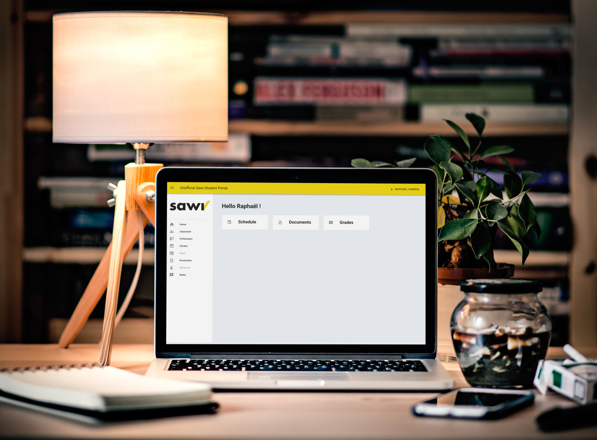

# Unofficial Sawi Student Portal

[](https://forthebadge.com)
[](https://forthebadge.com)



As the original is not very nice and not very user-friendly either, I decided to create a progressive web application with additional features such as a calendar and a better organization of course documents. 

## Contributing

Contributions are welcome and will be fully credited.

**Project setup**
```
yarn install
```

**Compiles and hot-reloads for development**
```
yarn run serve
```

**Compiles and minifies for production**
```
yarn run build
```

**Run tests**
```
yarn run test
```

**Lints and fixes files**
```
yarn run lint
```
